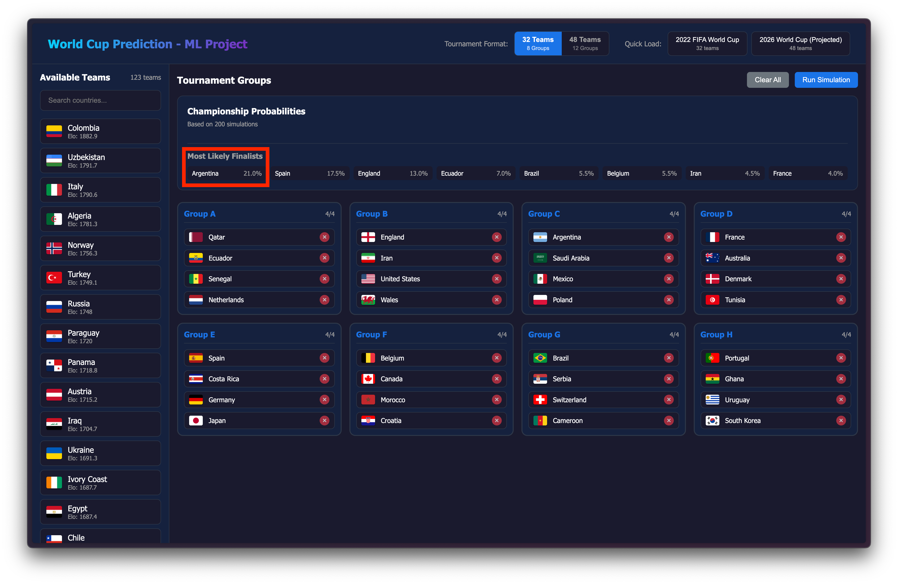

# 🏆 FIFA World Cup Prediction - Machine Learning Project

A machine learning-powered World Cup prediction system that uses **dual XGBoost regression models** and **Poisson-based Monte Carlo simulation** to generate full bracket predictions with probability estimates.

## 🌐 Live Demo

**Try the interactive simulation platform:**  
👉 [https://machine-learning-world-cup-prediction.up.railway.app/](https://machine-learning-world-cup-prediction.up.railway.app/)

Build your own tournament brackets, select teams, and run simulations to see championship probabilities in real-time!



_Interactive simulation interface showing the 2022 FIFA World Cup bracket with championship probabilities_

---

## 📖 About The Project

This project predicts FIFA World Cup outcomes using a novel approach: **predict goals, not outcomes**, then simulate probabilistically.

### Why This Approach?

-   **Binary classification loses information** — a 5-0 and 1-0 are both just "wins"
-   **Poisson distribution** is mathematically proven to model football goals effectively
-   **Monte Carlo simulation** gives robust probabilities, not fragile point predictions

---

## 🧠 Model Architecture

### Dual XGBoost Regressors

Instead of predicting win/loss/draw directly, we train two separate regression models:

| Model       | Purpose                  | Output             |
| ----------- | ------------------------ | ------------------ |
| **Model A** | Predicts Home Team Goals | Expected goals (λ) |
| **Model B** | Predicts Away Team Goals | Expected goals (λ) |

```python
# Model configuration
XGBRegressor(
    n_estimators=10000,
    max_depth=6,
    learning_rate=0.05,
    subsample=0.8
)
```

### Why Regression Over Classification?

-   Captures **goal differential** (a 3-0 win is more dominant than 1-0)
-   Naturally enables **Poisson simulation**
-   RMSE of **1.0-1.4 goals** indicates excellent performance

---

## 🔧 Feature Engineering

### Core Features (per team)

| Feature                 | Source        | Description                             |
| ----------------------- | ------------- | --------------------------------------- |
| `elo_rating`            | Calculated    | Running Elo rating from match history   |
| `avg_player_overall`    | EA FC Dataset | Mean overall rating of top 14 players   |
| `avg_player_attack`     | EA FC Dataset | Mean rating of top forwards/midfielders |
| `avg_player_defense`    | EA FC Dataset | Mean rating of top defenders + GK       |
| `last_5_goals_scored`   | Matches       | Average goals in last 5 matches         |
| `last_5_goals_conceded` | Matches       | Average conceded in last 5 matches      |
| `last_5_win_rate`       | Matches       | Win percentage in last 5 matches        |

### Match Context Features

| Feature               | Description                                 |
| --------------------- | ------------------------------------------- |
| `is_neutral`          | Always 1 for World Cup (neutral venue)      |
| `is_knockout`         | 1 for elimination rounds, 0 for group stage |
| `continental_matchup` | Encoding of confederations playing          |

### Elo Rating Calculation

We calculate custom Elo ratings using the standard formula:

```python
def calculate_elo(matches_df, k=32):
    elo = defaultdict(lambda: 1500)  # Start all teams at 1500

    for match in matches_df:
        # Expected scores based on current Elo
        exp_home = 1 / (1 + 10**((away_elo - home_elo) / 400))

        # Update Elo based on actual result
        elo[home] += k * (actual_home - exp_home)
        elo[away] += k * (actual_away - exp_away)

    return elo
```

---

## 🎲 Poisson Monte Carlo Simulation

The key innovation is using **Poisson distribution** to simulate match outcomes:

```python
from scipy.stats import poisson

def simulate_match(home_goals_pred, away_goals_pred, n_sims=10000):
    """
    Use predicted goals as lambda parameter for Poisson distribution.
    Returns win/draw/loss probabilities.
    """
    home_goals = poisson.rvs(mu=home_goals_pred, size=n_sims)
    away_goals = poisson.rvs(mu=away_goals_pred, size=n_sims)

    return {
        'home_win_prob': (home_goals > away_goals).mean(),
        'draw_prob': (home_goals == away_goals).mean(),
        'away_win_prob': (home_goals < away_goals).mean()
    }
```

### Why Poisson Works for Football

-   Goals are **rare, independent events**
-   Average goals per team per match: ~1.3-1.5
-   `Poisson(λ=1.4)` models this distribution perfectly
-   10,000 simulations converge to **stable probabilities**

---

## 🏟️ Tournament Simulation

The full tournament simulation runs thousands of iterations:

1. **Group Stage**: Simulate all group matches, calculate points and standings
2. **Knockout Rounds**: Simulate Round of 16 → Quarter Finals → Semi Finals → Final
3. **Aggregate Results**: Count championship wins across all simulations

```python
def simulate_tournament(teams_in_groups, n_sims=1000):
    championship_counts = Counter()

    for sim in range(n_sims):
        # Simulate group stage
        group_standings = simulate_groups(teams_in_groups)

        # Simulate knockout rounds
        champion = simulate_knockout(group_standings)
        championship_counts[champion] += 1

    return championship_counts
```

---

## 📊 Data Sources

| Dataset                                                                                                                    | Purpose                                     |
| -------------------------------------------------------------------------------------------------------------------------- | ------------------------------------------- |
| [International Football Results](https://www.kaggle.com/datasets/patateriedata/all-international-football-results)         | Match outcomes + goals for training         |
| [FIFA World Ranking](https://www.kaggle.com/datasets/cashncarry/fifaworldranking)                                          | Elo calculation validation                  |
| [EA Sports FC 24 Player Dataset](https://www.kaggle.com/datasets/stefanoleone992/ea-sports-fc-24-complete-player-dataset/) | Player aggregation (FIFA 15-24 yearly data) |

**Data Filtering**: Only matches from **2010 onwards** are used to capture modern football tactics and team dynamics.

---

## 📈 Model Performance

| Metric                              | Result       |
| ----------------------------------- | ------------ |
| RMSE (goals)                        | 1.0 - 1.4    |
| Match prediction accuracy (2022 WC) | 55-65%       |
| Correct group stage winners         | 60-70%       |
| Correct semifinalists               | 2-3 out of 4 |

---

## 🗂️ Project Structure

```
fifa-mens-world-cup-prediction/
├── backend/                    # FastAPI prediction server
│   ├── main.py                # API endpoints
│   ├── predictor.py           # Match prediction logic
│   └── model_artifacts/       # Trained models & data
│       ├── model_home_goals.joblib
│       ├── model_away_goals.joblib
│       ├── elo_ratings.json
│       └── player_aggregates.csv
├── frontend/                   # React TypeScript UI
│   └── src/
│       └── components/        # UI components
├── data/                       # Training datasets
├── wc_xgboost.ipynb           # Model training notebook
└── README.md
```

---

## 🚀 Getting Started

### Prerequisites

-   Python 3.10+
-   Node.js 18+

### Backend Setup

```bash
cd backend
pip install -r requirements.txt
uvicorn main:app --reload
```

### Frontend Setup

```bash
cd frontend
npm install
npm run dev
```

---

## 🛠️ Technologies Used

**Machine Learning:**

-   XGBoost (Regression)
-   Scikit-learn
-   Pandas / NumPy
-   SciPy (Poisson distribution)

**Backend:**

-   FastAPI
-   Python

**Frontend:**

-   React + TypeScript
-   Vite

**Deployment:**

-   Railway

---

## 📄 License

This project is for educational purposes as part of a machine learning course project.

---

## 🙏 Acknowledgments

-   Kaggle for providing the datasets
-   The international football statistics community
-   EA Sports for player rating data
