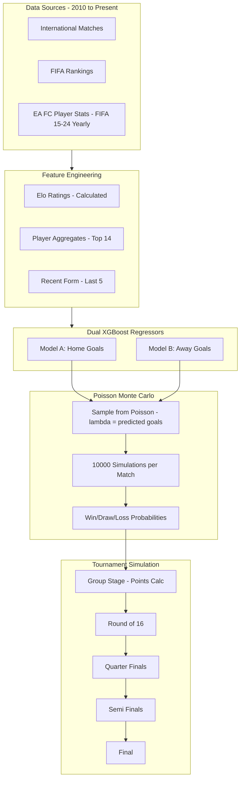

# World Cup Bracket Prediction Model (Optimized)

## Why This Approach Wins

The key insight: **Predict goals, not outcomes**. Then simulate probabilistically.

-   Binary classification loses information (a 5-0 and 1-0 are both "wins")
-   Poisson distribution is mathematically proven to model football goals
-   Monte Carlo gives robust probabilities, not fragile point predictions
-   This approach is used by professional betting models

## Architecture



## Datasets (Focused Selection)

| Dataset                                                                                                                                                     | Purpose                                     | Required |
| ----------------------------------------------------------------------------------------------------------------------------------------------------------- | ------------------------------------------- | -------- |
| [International Football Results](https://www.kaggle.com/datasets/patateriedata/all-international-football-results)                                          | Match outcomes + goals for training         | YES      |
| [FIFA World Ranking](https://www.kaggle.com/datasets/cashncarry/fifaworldranking)                                                                           | For Elo calculation validation              | YES      |
| [EA Sports FC 24 Complete Player Dataset](https://www.kaggle.com/datasets/stefanoleone992/ea-sports-fc-24-complete-player-dataset/?select=male_players.csv) | Player aggregation (FIFA 15-24 yearly data) | YES      |

Only 3 datasets - keep it simple.

**Why this player dataset is better:** Contains yearly player data from FIFA 15 through FC 24 (2014-2024), allowing us to match player stats to the correct match year and significantly reduce data leakage.

## Model Architecture

### Dual XGBoost Regressors

```python
# Model A: Predicts Home Team Goals
model_home = XGBRegressor(
    n_estimators=500,
    max_depth=6,
    learning_rate=0.05,
    subsample=0.8
)

# Model B: Predicts Away Team Goals
model_away = XGBRegressor(
    n_estimators=500,
    max_depth=6,
    learning_rate=0.05,
    subsample=0.8
)
```

### Why Regression Over Classification

-   Captures goal differential (a 3-0 win is more dominant than 1-0)
-   Naturally enables Poisson simulation
-   RMSE of 1.0-1.4 goals is excellent performance

## Feature Set (Merged from Both Plans)

### Core Features (per team)

| Feature | Source | Description |

|---------|--------|-------------|

| `elo_rating` | Calculated | Running Elo from match history |

| `avg_player_overall` | FIFA dataset | Mean overall rating of top 14 players |

| `avg_player_attack` | FIFA dataset | Mean of top forwards/midfielders |

| `avg_player_defense` | FIFA dataset | Mean of top defenders + GK |

| `last_5_goals_scored` | Matches | Average goals in last 5 matches |

| `last_5_goals_conceded` | Matches | Average conceded in last 5 matches |

| `last_5_win_rate` | Matches | Win percentage in last 5 |

### Match Context Features

| Feature               | Description                                       |
| --------------------- | ------------------------------------------------- |
| `is_neutral`          | 1 for World Cup (always neutral), 0 for home/away |
| `is_knockout`         | 1 for elimination rounds, 0 for group stage       |
| `continental_matchup` | Encoding of which confederations are playing      |

### CRITICAL: Neutral Venue Flag

**This is essential for accuracy.** In World Cup matches, teams are listed as "Home" and "Away" for administrative purposes only - there is NO actual home advantage.

```python
# When predicting World Cup matches, ALWAYS force neutral venue
def predict_world_cup_match(team_a, team_b, model_home, model_away, features):
    features['is_neutral'] = 1  # CRITICAL: No home advantage in World Cup
    # ... rest of prediction
```

Without this correction, the model would incorrectly give ~10-15% advantage to the administratively-listed "home" team.

### Data Leakage Handling

**Problem:** We have FIFA 15-24 player data, but when training on a 2016 match, we shouldn't use 2024 player stats.

**Solution with EA Sports FC 24 dataset:**

```python
# Match player stats to the correct year
def get_player_stats_for_year(players_df, match_year):
    # FIFA 15 = 2014/2015, FIFA 16 = 2015/2016, etc.
    fifa_version = match_year - 2000 + 1  # Approximate mapping
    return players_df[players_df['fifa_version'] == fifa_version]
```

This dataset contains yearly snapshots, so we can properly align player quality to the match date.

### Country Name Normalization (Critical for Data Merging)

**Problem:** Country names differ across datasets:

-   International Matches: "United States", "Korea Republic", "Côte d'Ivoire"
-   FIFA Rankings: "USA", "South Korea", "Ivory Coast"
-   EA FC Players: "United States of America", "Korea", "Ivory Coast"

**Solution:** Create a unified country name mapping dictionary:

```python
# Master country name normalization dictionary
COUNTRY_NAME_MAP = {
    # Canonical name -> list of variations found in datasets
    'United States': ['USA', 'United States of America', 'U.S.A.'],
    'South Korea': ['Korea Republic', 'Korea', 'Republic of Korea'],
    'North Korea': ['Korea DPR', 'DPR Korea'],
    'England': ['England'],  # Note: FIFA players have nationality, not team
    'Ivory Coast': ['Côte d\'Ivoire', 'Cote d\'Ivoire'],
    'China': ['China PR', 'People\'s Republic of China'],
    'Iran': ['IR Iran'],
    'Czech Republic': ['Czechia'],
    'DR Congo': ['Congo DR', 'Democratic Republic of Congo'],
    'Congo': ['Congo Republic', 'Republic of Congo'],
    'Vietnam': ['Viet Nam'],
    'Russia': ['Russian Federation'],
    'Turkey': ['Türkiye'],
    # Add more as discovered during data exploration
}

def normalize_country_name(name, name_map=COUNTRY_NAME_MAP):
    """Convert any country name variant to canonical form."""
    for canonical, variants in name_map.items():
        if name in variants or name == canonical:
            return canonical
    return name  # Return as-is if no mapping found

# Apply to all datasets
matches_df['home_team'] = matches_df['home_team'].apply(normalize_country_name)
matches_df['away_team'] = matches_df['away_team'].apply(normalize_country_name)
rankings_df['country'] = rankings_df['country'].apply(normalize_country_name)
players_df['nationality'] = players_df['nationality'].apply(normalize_country_name)
```

**Important:** The International Matches dataset includes a file with historical name changes (e.g., "Zaire" -> "DR Congo"). Load this file and integrate it into the mapping.

```python
# Load the dataset's own name mapping file
name_changes = pd.read_csv('name_changes.csv')  # old_name, new_name columns
for _, row in name_changes.iterrows():
    old_name, new_name = row['old_name'], row['new_name']
    # Add to our master mapping
    if new_name in COUNTRY_NAME_MAP:
        COUNTRY_NAME_MAP[new_name].append(old_name)
    else:
        COUNTRY_NAME_MAP[new_name] = [old_name]
```

### Model and Data Persistence (For Later Inference)

Save all trained artifacts so predictions can be made without retraining:

```python
import joblib
import json

def save_model_artifacts(output_dir='model_artifacts/'):
    """Save all components needed for inference."""
    import os
    os.makedirs(output_dir, exist_ok=True)

    # 1. Save trained XGBoost models
    joblib.dump(model_home, f'{output_dir}/model_home_goals.joblib')
    joblib.dump(model_away_goals, f'{output_dir}/model_away_goals.joblib')

    # 2. Save current Elo ratings (as of last training date)
    with open(f'{output_dir}/elo_ratings.json', 'w') as f:
        json.dump(dict(elo_ratings), f, indent=2)

    # 3. Save player aggregates by country (latest year)
    player_aggregates.to_csv(f'{output_dir}/player_aggregates.csv', index=False)

    # 4. Save country name mapping
    with open(f'{output_dir}/country_name_map.json', 'w') as f:
        json.dump(COUNTRY_NAME_MAP, f, indent=2)

    # 5. Save feature column order (critical for prediction)
    with open(f'{output_dir}/feature_columns.json', 'w') as f:
        json.dump(list(X_train.columns), f)

    # 6. Save recent form stats (for teams' last 5 matches)
    recent_form.to_csv(f'{output_dir}/recent_form.csv', index=False)

    print(f"All artifacts saved to {output_dir}")

def load_model_artifacts(input_dir='model_artifacts/'):
    """Load all components needed for inference."""
    model_home = joblib.load(f'{input_dir}/model_home_goals.joblib')
    model_away = joblib.load(f'{input_dir}/model_away_goals.joblib')

    with open(f'{input_dir}/elo_ratings.json', 'r') as f:
        elo_ratings = json.load(f)

    player_aggregates = pd.read_csv(f'{input_dir}/player_aggregates.csv')

    with open(f'{input_dir}/country_name_map.json', 'r') as f:
        country_name_map = json.load(f)

    with open(f'{input_dir}/feature_columns.json', 'r') as f:
        feature_columns = json.load(f)

    recent_form = pd.read_csv(f'{input_dir}/recent_form.csv')

    return {
        'model_home': model_home,
        'model_away': model_away,
        'elo_ratings': elo_ratings,
        'player_aggregates': player_aggregates,
        'country_name_map': country_name_map,
        'feature_columns': feature_columns,
        'recent_form': recent_form
    }
```

**Artifacts saved:**
| File | Purpose |
|------|---------|
| `model_home_goals.joblib` | XGBoost model for home team goals |
| `model_away_goals.joblib` | XGBoost model for away team goals |
| `elo_ratings.json` | Current Elo rating per country |
| `player_aggregates.csv` | Aggregated player stats per country |
| `country_name_map.json` | Country name normalization mapping |
| `feature_columns.json` | Ordered list of feature column names |
| `recent_form.csv` | Last 5 match stats per country |

### Elo Calculation (Simple Loop)

```python
def calculate_elo(matches_df, k=32):
    elo = defaultdict(lambda: 1500)  # Start all teams at 1500

    for _, match in matches_df.iterrows():
        home, away = match['home_team'], match['away_team']
        home_elo, away_elo = elo[home], elo[away]

        # Expected scores
        exp_home = 1 / (1 + 10**((away_elo - home_elo) / 400))
        exp_away = 1 - exp_home

        # Actual scores (1=win, 0.5=draw, 0=loss)
        if match['home_score'] > match['away_score']:
            actual_home, actual_away = 1, 0
        elif match['home_score'] < match['away_score']:
            actual_home, actual_away = 0, 1
        else:
            actual_home, actual_away = 0.5, 0.5

        # Update Elo
        elo[home] += k * (actual_home - exp_home)
        elo[away] += k * (actual_away - exp_away)

    return elo
```

## Poisson Simulation (The Key Innovation)

```python
from scipy.stats import poisson

def simulate_match(home_goals_pred, away_goals_pred, n_sims=10000):
    """
    Use predicted goals as lambda parameter for Poisson distribution.
    Returns win/draw/loss probabilities.
    """
    home_goals = poisson.rvs(mu=home_goals_pred, size=n_sims)
    away_goals = poisson.rvs(mu=away_goals_pred, size=n_sims)

    home_wins = (home_goals > away_goals).mean()
    draws = (home_goals == away_goals).mean()
    away_wins = (home_goals < away_goals).mean()

    return {
        'home_win_prob': home_wins,
        'draw_prob': draws,
        'away_win_prob': away_wins,
        'expected_home_goals': home_goals_pred,
        'expected_away_goals': away_goals_pred
    }
```

### Why Poisson Works for Football

-   Goals are rare, independent events
-   Average goals per team per match: ~1.3-1.5
-   Poisson(lambda=1.4) models this perfectly
-   10,000 simulations converge to stable probabilities

## Data Filtering Strategy

**Use 2010+ data only:**

-   Modern football tactics (high press, possession-based)
-   Better fitness and sports science
-   More relevant to current teams
-   Older data adds noise, not signal

**Training/Validation Split:**

-   Train: 2010-2021 (all international matches)
-   Validation: 2018 World Cup (during development)
-   Test: 2022 World Cup (final accuracy report)
-   Predict: 2026 World Cup

## Tournament Simulation Algorithm

```python
def simulate_tournament(teams_in_groups, model_home, model_away, n_tournament_sims=1000):
    bracket_results = []

    for sim in range(n_tournament_sims):
        # GROUP STAGE
        group_standings = {}
        for group, teams in teams_in_groups.items():
            points = {team: 0 for team in teams}
            for home, away in itertools.combinations(teams, 2):
                result = simulate_single_match(home, away, model_home, model_away)
                # Update points based on result
            group_standings[group] = sorted(teams, key=lambda t: points[t], reverse=True)

        # KNOCKOUT STAGE
        r16_winners = simulate_knockout_round(...)
        qf_winners = simulate_knockout_round(...)
        sf_winners = simulate_knockout_round(...)
        champion = simulate_knockout_round(...)

        bracket_results.append(champion)

    # Return probability distribution over champions
    return Counter(bracket_results)
```

## Time Allocation (6-7 hours)

| Phase                 | Time   | Key Tasks                                       |
| --------------------- | ------ | ----------------------------------------------- |
| Setup + Data          | 30 min | Download 3 datasets, load, filter to 2010+      |
| Country Normalization | 30 min | Build mapping dict, normalize all country names |
| Elo Calculation       | 30 min | Calculate Elo ratings for all teams             |
| Player Aggregation    | 45 min | Aggregate top 14 players per country by year    |
| Feature Engineering   | 1 hour | Create all features, merge into training set    |
| Model Training        | 1 hour | Train dual XGBoost, tune hyperparameters        |
| Save Artifacts        | 15 min | Persist models, Elo, stats for later inference  |
| Validation            | 45 min | Test on 2022 WC, calculate accuracy             |
| Tournament Simulation | 1 hour | Build simulator, generate 2026 bracket          |
| Visualization         | 30 min | Create bracket visualization for presentation   |

## Expected Performance

| Metric | Target |

|--------|--------|

| RMSE (goals) | 1.0 - 1.4 |

| Match prediction accuracy (2022 WC) | 55-65% |

| Correct group stage winners | 60-70% |

| Correct semifinalists | 2-3 out of 4 |

## Presentation Highlights

1. **Probability tables** - Show win/draw/loss % for each match
2. **Elo rankings** - Visual comparison of team strengths
3. **Feature importance** - What drives predictions (great for Q&A)
4. **Bracket with probabilities** - Each advancement shows %
5. **2022 validation** - Show what model got right/wrong

## Notebook Structure

1. **Setup** - Kaggle API, imports
2. **Data Loading** - 3 datasets
3. **Country Name Normalization** - Build mapping, normalize all datasets
4. **Elo Calculation** - Historical Elo for all teams
5. **Player Aggregation** - Country-level player stats by year
6. **Feature Engineering** - Merge everything
7. **Model Training** - Dual XGBoost regressors
8. **Save Artifacts** - Persist models, Elo, player stats for inference
9. **Poisson Simulator** - Match simulation function
10. **2022 Validation** - Test and report accuracy
11. **2026 Bracket** - Full tournament simulation
12. **Visualization** - Bracket + probability charts
